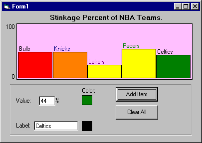



## Chart Control \- EASILY CHART STATISTICS\.\. MUST SEE\!

### Description

This control will let you visually display Data in an easy to understand way.
 
### More Info
 

             |
---                |---
**Submitted On**   |2000-08-17 13:42:30
**By**             |[Sparq](https://github.com/Planet-Source-Code/PSCIndex/blob/master/ByAuthor/sparq.md)
**Level**          |Beginner
**User Rating**    |4.0 (32 globes from 8 users)
**Compatibility**  |VB 6\.0
**Category**       |[Custom Controls/ Forms/  Menus](https://github.com/Planet-Source-Code/PSCIndex/blob/master/ByCategory/custom-controls-forms-menus__1-4.md)
**World**          |[Visual Basic](https://github.com/Planet-Source-Code/PSCIndex/blob/master/ByWorld/visual-basic.md)
**Archive File**   |[CODE\_UPLOAD90408172000\.zip](https://github.com/Planet-Source-Code/sparq-chart-control-easily-chart-statistics-must-see__1-10756/archive/master.zip)

